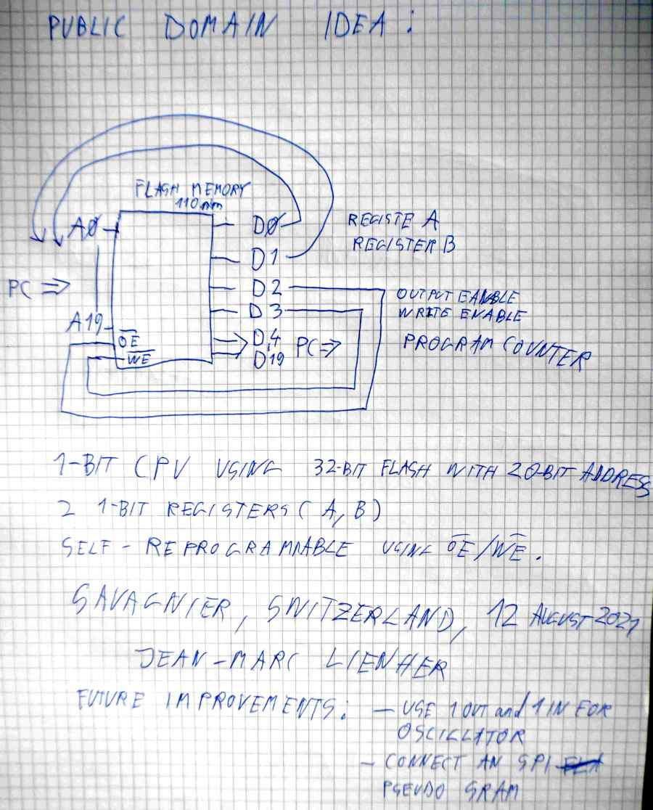
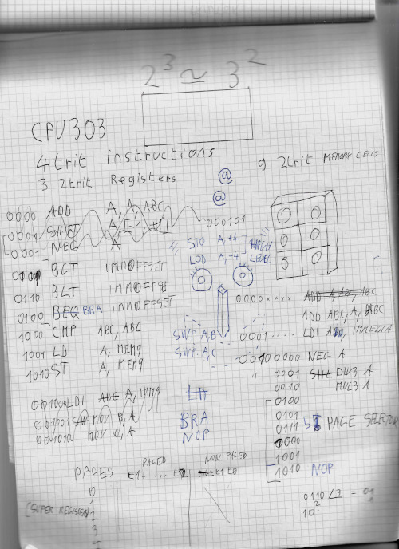

# 3o3 
Ternary CPU in Verilog for EPROM and FLASH memories

```
sudo apt install build-essential git curl libtinfo5 iverilog 
./build.cmd
```

## Instruction set for a 2 trits (6 bits) CPU

imm9: 2 balanced trits means that registers can hold value in the range form -4 to +4.

a: register A

b: register B

c: register C

rd: destination register either a,b or c
rs1: 1st source register either a,b or c
rs2: 2nd source register either a,b or c

mem9: address of a super register. There is 5 pages of 8 super registers. Super registers are used to make a 16 trits value that can be tranfered to or from main memory, peripherals or program counter.


add rd,a,rs2

ldi a,imm9

neg a,a

div a,a,3

mul a,a,3

cmp a,rs2

cmp b, a or c

cmp c, a or b

swp a,b

swp a,c

bgt label

blt label

bra label

pge 0 to 4

lod a,mem9

sto a,mem9

nop


## Ternary logic computer... 






## Some links

https://homepage.cs.uiowa.edu/~jones/ternary/

https://www.youtube.com/watch?v=J94FavGqvCQ

https://bailleux.net/pub/ob-project-gray1.pdf

https://www.youtube.com/watch?v=J-pyCxMg-xg

https://www.youtube.com/watch?v=seyHAFpsoP8


